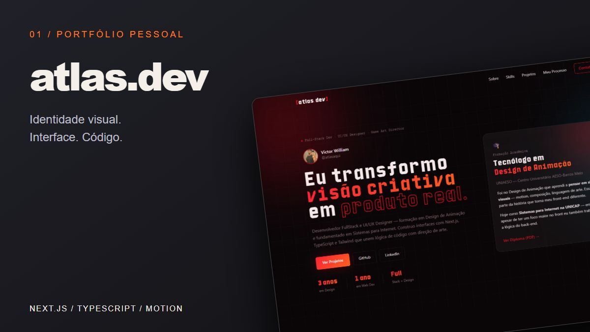
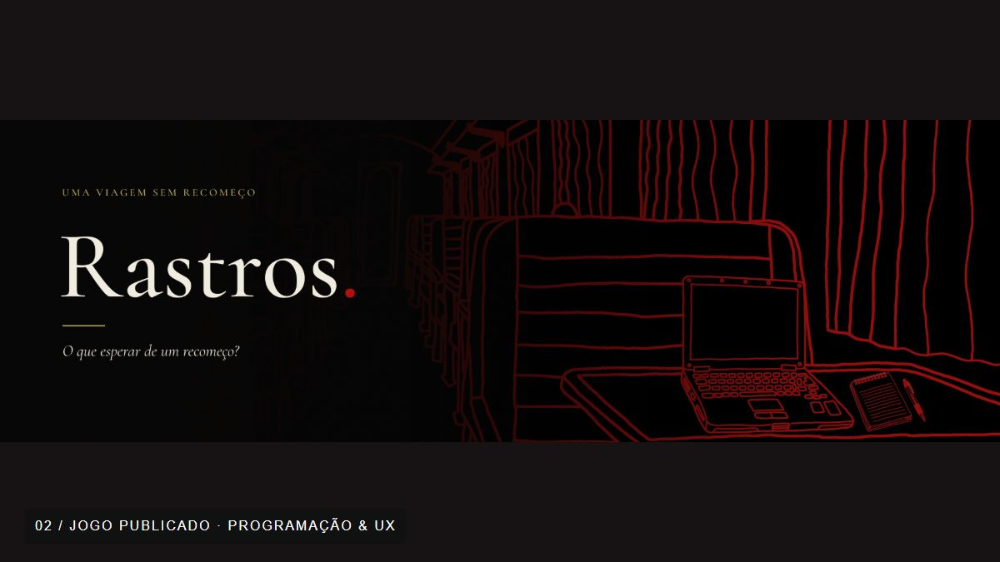
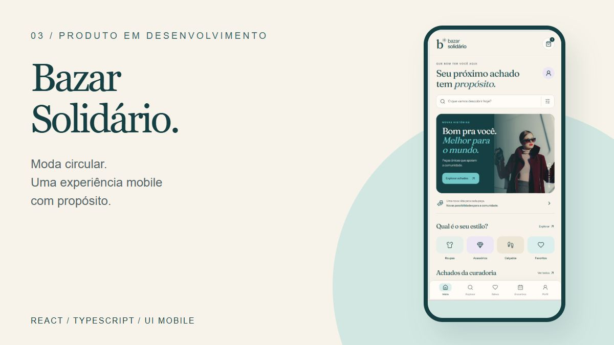
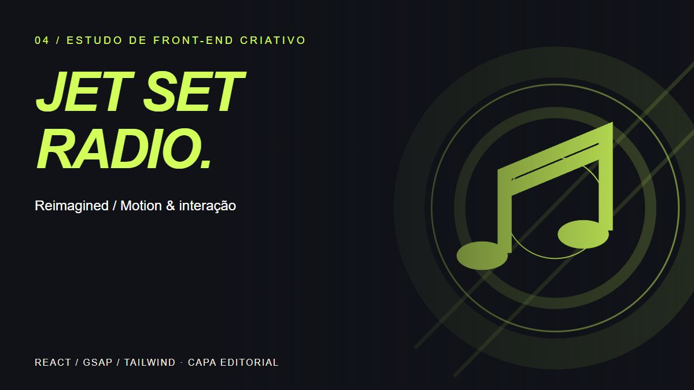

  <a href="https://atlasaquidev.vercel.app/"><strong>Explorar portfólio ↗</strong></a> &nbsp; / &nbsp;
  <a href="https://www.linkedin.com/in/atlasaqui/">LinkedIn</a> &nbsp; / &nbsp;
  <a href="#projetos-selecionados">Projetos selecionados</a>

Sou **Victor Monteiro**, designer de UI/UX e desenvolvedor com foco em front-end. Formado em **Design de Animação pela UNIAESO** e estudante de **Sistemas para Internet na UNICAP**, conecto composição visual, interação e implementação em interfaces para web e jogos.

Meu trabalho reúne **identidade visual, prototipagem no Figma, componentes em React e integração com APIs**. Os projetos abaixo mostram essa combinação em diferentes contextos: portfólio, experiência narrativa, produto mobile e experimentação com motion.

## Projetos selecionados

<table>
<tr>
<td width="50%" valign="top">

### 01 / Atlas.dev

**Portfólio publicado · Design & front-end**

Meu espaço para apresentar projetos, protótipos e processo. Identidade visual própria, navegação responsiva, galerias e animações conectam minha atuação em design ao desenvolvimento.

**Atuação:** concepção visual e implementação do portfólio.

`Next.js` `TypeScript` `Tailwind CSS` `Framer Motion`

[**Visitar site ↗**](https://atlasaquidev.vercel.app/) · [Código](https://github.com/atlasaqui/Atlas.Dev-Website) · [Figma](https://www.figma.com/design/2UtdxO0LT8r2wEVFJQK11n/Atlas---Portifolio?node-id=0-1)

</td>
<td width="50%" valign="top">

### 02 / Rastros

**Jogo publicado · Programação & UX**

Investigação e terror psicológico desenvolvidos em equipe para uma game jam literária. Exploração, diálogos, puzzles e um computador fictício, o Iwakura OS, conduzem a narrativa.

**Minha contribuição:** programação e UX Design, conforme os créditos do jogo. Narrativa, arte e áudio são trabalhos da equipe.

`Java / JavaFX` `React` `JavaScript` `Game UX`

[**Baixar e jogar ↗**](https://atlasaqui.itch.io/rastros) · [Código](https://github.com/atlasaqui/rastros) · [Arquitetura](https://github.com/atlasaqui/rastros/blob/main/docs/ARQUITETURA.md)

</td>
</tr>
<tr>
<td width="50%" valign="top">

### 03 / Bazar Solidário

**Em desenvolvimento · UI mobile & integração**

Projeto colaborativo de moda circular com proposta de apoio a ONGs. A experiência reúne catálogo, busca, filtros, favoritos, sacola e cadastro conectado ao backend existente.

**Minha contribuição:** design da interface e front-end React/TypeScript, adaptação ao contrato de cadastro e testes do cliente da API.

`React` `TypeScript` `Vite` `Figma` `API REST`

[**Ver minha contribuição ↗**](https://github.com/Mateus-F-Moura/bazar-solidario/tree/feat/frontend-mobile/frontend) · [Protótipo no Figma](https://www.figma.com/design/UNlqj03qJ6BsaAX9sUwxiL?node-id=3-19)

Cadastro integrado. Catálogo, eventos e checkout ainda demonstrativos; login e vendas reais fazem parte das próximas etapas.

</td>
<td width="50%" valign="top">

### 04 / Jet Set Radio — Reimagined

**Estudo autoral · Front-end criativo**

Reinterpretação web da estética urbana de Jet Set Radio. Um laboratório de composição, transições, animação por scroll e interação com React e GSAP.

**Atuação:** desenvolvimento da experiência web e composição da interface. Estudo independente inspirado na SEGA, sem vínculo oficial.

`React` `JavaScript` `Tailwind CSS` `GSAP`

[**Explorar o código ↗**](https://github.com/atlasaqui/MY-SEGA-GAME-WEBSITE)

Capa editorial do estudo; referências à SEGA e aos respectivos autores pertencem ao projeto original.

</td>
</tr>
</table>

## Do protótipo à implementação

| Etapa | Como trabalho |
| :--- | :--- |
| **Entender** | Identifico o objetivo, os fluxos principais e as restrições do projeto. |
| **Desenhar** | Organizo a informação e defino hierarquia, tipografia, cores e componentes no Figma. |
| **Construir** | Transformo a proposta em interfaces responsivas, estados de interação e integração com APIs. |
| **Verificar** | Reviso navegação, legibilidade, comportamento no celular e os fluxos implementados. |

**Protótipos de UI/UX:** [Correct-on](https://www.figma.com/design/nvS9tl1DSwGTM7D8VkuTSX/Correct-on?node-id=0-1) · [Contratas / HireUp](https://www.figma.com/design/hSr45dNn8729POKBppWPbU/HireUp?node-id=77-2653). Mais telas e trabalhos de Game UI estão no [portfólio](https://atlasaquidev.vercel.app/#projetos).

## Ferramentas no meu trabalho

| Frente | Tecnologias e prática |
| :--- | :--- |
| **Front-end** | React, Next.js, TypeScript, JavaScript, HTML, CSS e Tailwind CSS |
| **Interação & motion** | GSAP, Framer Motion e interfaces narrativas |
| **Design** | Figma, prototipagem, identidade visual, design tokens e composição |
| **Integração & dados** | APIs REST, Java, JavaFX, PostgreSQL e Supabase |
| **Desenvolvimento** | Git, GitHub, Vite e Vercel |

## Outros projetos e estudos

- [**Solaris**](https://github.com/atlasaqui/solaris) — aplicação em desenvolvimento para clínicas dermatológicas. React, TypeScript e TanStack Start, com módulos de pacientes, conteúdo, personalização, Supabase e Stripe. Complementa o portfólio com fluxos de produto e integração.
- [**Ashen Brew**](https://github.com/atlasaqui/Ashen-Brew-Ecommerce-Project) — estudo de uma interface temática de taverna com Next.js, TypeScript e GSAP. Foco atual em identidade, tipografia e hero com vídeo.
- [**EduStats**](https://github.com/atlasaqui/EduStats-WebSite) e [**To-do App**](https://github.com/atlasaqui/TO-DO-APP-PROJECT) — outros exercícios de interfaces web.
- [**Fundamentos em Java**](https://github.com/atlasaqui/imperative-programming---Java) — estudos acadêmicos de lógica e programação, complementados pelos demais repositórios de exercícios.

## Vamos conversar

Tenho interesse em projetos e oportunidades de **front-end, UI/UX, web design e interfaces para jogos**. Para conhecer meu trabalho em contexto, comece pelo portfólio ou pelo Rastros.

[**Portfólio ↗**](https://atlasaquidev.vercel.app/) &nbsp; · &nbsp; [**LinkedIn ↗**](https://www.linkedin.com/in/atlasaqui/)

Victor William Monteiro da Rocha · Recife, PE · Seleção atualizada em outubro de 2026.
