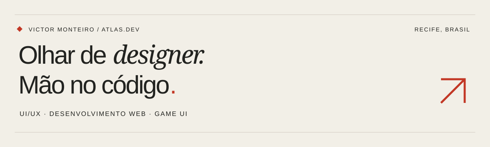
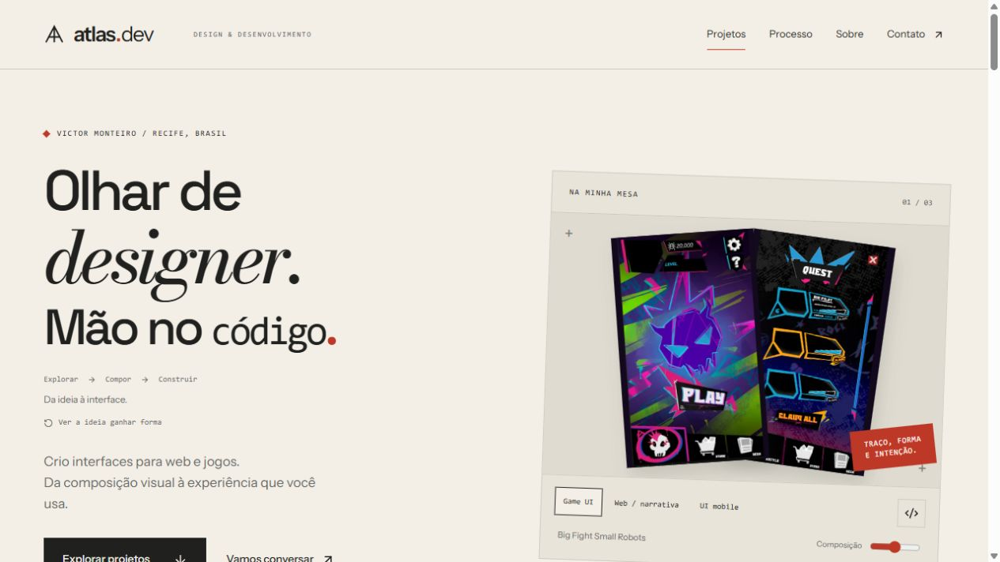
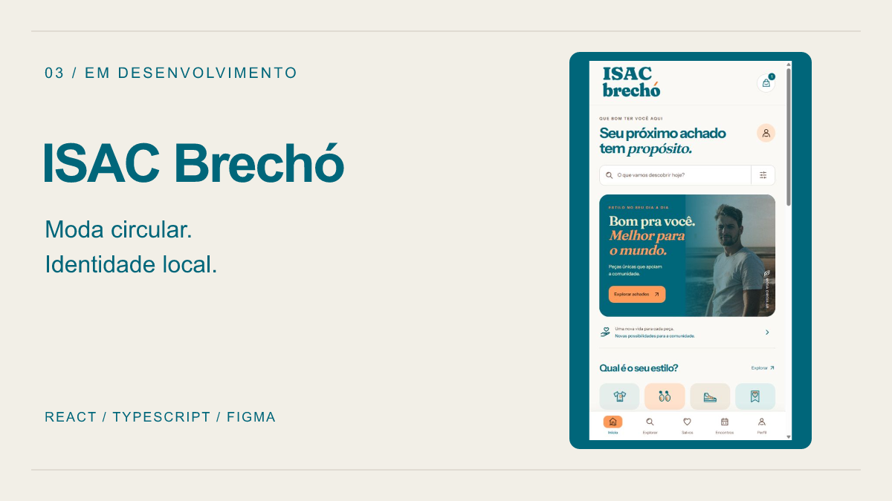
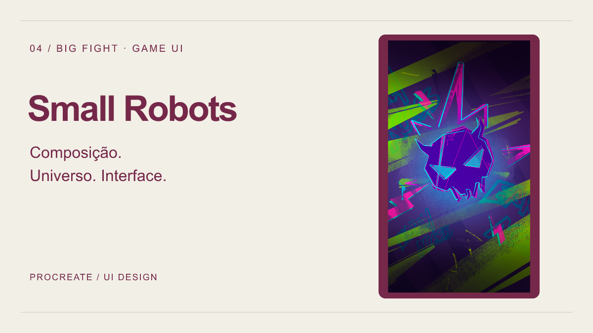

  <a href="https://atlasaquidev.vercel.app/"><strong>Explorar portfólio ↗</strong></a> &nbsp; / &nbsp;
  <a href="https://www.linkedin.com/in/atlasaqui/">LinkedIn</a> &nbsp; / &nbsp;
  <a href="#projetos-selecionados">Projetos selecionados</a>

Sou **Victor Monteiro**, designer de UI/UX e desenvolvedor web, com atuação em front-end e back-end. Formado em **Design de Animação pela UNIAESO** e estudante de **Sistemas para Internet na UNICAP**, conecto composição visual, interação e implementação em interfaces para web e jogos.

Meu trabalho reúne **identidade visual, prototipagem no Figma, componentes em React e integração com APIs**. Os projetos abaixo mostram essa combinação em diferentes contextos: portfólio, experiência narrativa, produto mobile e experimentação com motion.

## Projetos selecionados

<table>
<tr>
<td width="50%" valign="top">

### 01 / Atlas.dev

**Portfólio publicado · Design & front-end**

Meu espaço para apresentar projetos, protótipos e processo. Identidade editorial, estudos de caso e interações com propósito. A sequência Explorar → Compor → Construir apresenta meu processo; o laboratório permite experimentar componentes e o movimento respeita a preferência por animação reduzida.

**Atuação:** concepção visual e implementação do portfólio.

`Next.js` `TypeScript` `Tailwind CSS` `Framer Motion`

[**Visitar site ↗**](https://atlasaquidev.vercel.app/) · [Código](https://github.com/atlasaqui/Atlas.Dev-Website) · [Figma](https://www.figma.com/design/khVWogXGHfvQijb36I0Atd)

</td>
<td width="50%" valign="top">

### 02 / Rastros

**Jogo publicado · Programação & UX**

Investigação e terror psicológico desenvolvidos em equipe para uma game jam literária. Exploração, diálogos, puzzles e um computador fictício, o Iwakura OS, conduzem a narrativa.

**Minha contribuição:** programação e UX Design, conforme os créditos do jogo. Narrativa, arte e áudio são trabalhos da equipe.

`Java / JavaFX` `React` `JavaScript` `Game UX`

[**Baixar e jogar ↗**](https://atlasaqui.itch.io/rastros) · [Código](https://github.com/atlasaqui/rastros) · [Arquitetura](https://github.com/atlasaqui/rastros/blob/main/docs/ARQUITETURA.md)

</td>
</tr>
<tr>
<td width="50%" valign="top">

### 03 / ISAC Brechó

**Em desenvolvimento · UI mobile & integração**

Projeto de residência tecnológica em parceria com o Porto Digital e a ONG ISAC, dedicado à moda circular e ao estilo acessível. A experiência reúne catálogo, busca, filtros, favoritos, sacola e cadastro conectado ao backend existente.

**Minha contribuição:** design da interface e front-end React/TypeScript, adaptação ao contrato de cadastro e testes do cliente da API.

`React` `TypeScript` `Vite` `Figma` `API REST`

[**Ver minha contribuição ↗**](https://github.com/Mateus-F-Moura/bazar-solidario/tree/feat/frontend-mobile/frontend) · [Protótipo no Figma](https://www.figma.com/design/UNlqj03qJ6BsaAX9sUwxiL?node-id=93-1437)

Cadastro integrado. Catálogo, eventos e checkout ainda demonstrativos; login e vendas reais fazem parte das próximas etapas.

</td>
<td width="50%" valign="top">

### 04 / Big Fight Small Robots

**Game UI · Criação e direção visual**

Interfaces para uma arena mobile: composição, hierarquia de ações e linguagem gráfica conectadas ao universo do jogo. Arte desenvolvida no Procreate, com telas e estudos apresentados no portfólio.

**Minha contribuição:** criação e desenvolvimento visual da UI. O destaque apresenta o trabalho de interface, sem afirmar um jogo publicado.

`Procreate` `Game UI` `Composição visual` `UI Design`

[**Ver telas e decisões ↗**](https://atlasaquidev.vercel.app/projetos/big-fight-small-robots)

</td>
</tr>
</table>

## Do protótipo à implementação

| Etapa | Como trabalho |
| :--- | :--- |
| **Entender** | Identifico o objetivo, os fluxos principais e as restrições do projeto. |
| **Dar forma** | Organizo a informação e defino hierarquia, tipografia, cores e componentes no Figma; para Game UI, também uso o Procreate. |
| **Construir** | Transformo a proposta em interfaces responsivas, estados de interação e integração com APIs. |
| **Revisar** | Reviso navegação, legibilidade, comportamento no celular e os fluxos implementados. |

**Protótipos de UI/UX:** [Correct-on](https://www.figma.com/design/nvS9tl1DSwGTM7D8VkuTSX/Correct-on?node-id=0-1) · [Contratas / HireUp](https://www.figma.com/design/hSr45dNn8729POKBppWPbU/HireUp?node-id=77-2653). Mais telas e trabalhos de Game UI estão no [portfólio](https://atlasaquidev.vercel.app/#projetos).

## Ferramentas no meu trabalho

| Frente | Tecnologias e prática |
| :--- | :--- |
| **Front-end** | React, Next.js, TypeScript, JavaScript, HTML, CSS e Tailwind CSS |
| **Interação & motion** | GSAP, Framer Motion e interfaces narrativas |
| **Design** | Figma, Procreate, prototipagem, identidade visual, design tokens e composição |
| **Back-end & dados** | APIs REST, Java, JavaFX, PostgreSQL e Supabase |
| **Desenvolvimento** | Git, GitHub, Vite e Vercel |

## Experiência em residência tecnológica

Projetos colaborativos em parceria com o **Porto Digital**, conectando aprendizagem e desafios de organizações:

- **Kick Off · ago–dez/2025:** design de produto para uma aplicação de acompanhamento da aprendizagem da escrita infantil, com atividades e relatórios de evolução.
- **Beyond · fev–jun/2026:** design e programação de uma aplicação de apoio à dermatologia, com gamificação e conteúdo para pacientes. Desenvolvimento assistido pelo Lovable e ajustes manuais; informações clínicas dependem de revisão do profissional.
- **ISAC · set–dez/2026 (em andamento):** design e desenvolvimento manual do front-end de um brechó solidário, com experiência mobile e integração ao backend colaborativo.

## Outros projetos e estudos

- [**Jet Set Radio — Reimagined**](https://github.com/atlasaqui/MY-SEGA-GAME-WEBSITE) — estudo independente de front-end criativo com React e GSAP, inspirado na linguagem urbana do jogo.
- [**Bode do Nô**](https://atlasaquidev.vercel.app/projetos/bode-do-no) — estudo independente de web design e implementação, sem vínculo oficial com a marca.
- [**Solaris**](https://github.com/atlasaqui/solaris) — aplicação em desenvolvimento para clínicas dermatológicas. React, TypeScript e TanStack Start, com módulos de pacientes, conteúdo, personalização, Supabase e Stripe. Complementa o portfólio com fluxos de produto e integração.
- [**Ashen Brew**](https://github.com/atlasaqui/Ashen-Brew-Ecommerce-Project) — estudo de uma interface temática de taverna com Next.js, TypeScript e GSAP. Foco atual em identidade, tipografia e hero com vídeo.
- [**EduStats**](https://github.com/atlasaqui/EduStats-WebSite) e [**To-do App**](https://github.com/atlasaqui/TO-DO-APP-PROJECT) — outros exercícios de interfaces web.
- [**Fundamentos em Java**](https://github.com/atlasaqui/imperative-programming---Java) — estudos acadêmicos de lógica e programação, complementados pelos demais repositórios de exercícios.

## Vamos conversar

Tenho interesse em projetos e oportunidades de **desenvolvimento web, front-end, back-end, UI/UX e interfaces para jogos**. Para conhecer meu trabalho em contexto, comece pelo portfólio ou pelo Rastros.

[**Portfólio ↗**](https://atlasaquidev.vercel.app/) &nbsp; · &nbsp; [**LinkedIn ↗**](https://www.linkedin.com/in/atlasaqui/)

Victor William Monteiro da Rocha · Recife, PE · Seleção atualizada em outubro de 2026.
